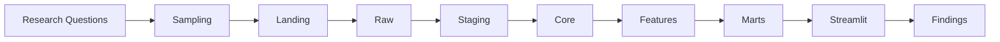

> ⚠️ This repository documents an active research and engineering project.
>
> The methodology is frozen for Version 1.1, while the implementation is under active development.
>
> Changes to the methodology are introduced only through versioned revisions of this Analysis Design Document.

# Analysis Design Document (ADD)

**Version**: 1.1
**Status**: Frozen for Version 1.1
**Last Updated**: August 2026

## Change Log
- **v1.1**: Adopted Two-Axis Channel Stratification taxonomy.
- **v1.0**: Initial frozen methodology.

---

## Abstract

The Football Narrative Observatory is a data engineering and analytical platform designed to investigate how observed football discourse evolves around major events involving Lionel Messi and Cristiano Ronaldo.

Rather than estimating global public opinion, the platform analyses a documented, stratified sample of English-language YouTube comments. It combines quota-aware ingestion, dimensional data warehousing, entity-targeted NLP, and matched-event analytical frameworks to distinguish changes in audience composition from changes in expressed opinion while explicitly reporting uncertainty, sampling limitations, and methodological boundaries.

This document defines the methodological contract governing every downstream component of the project.

---

## Terminology

- **Observed Author**: A unique, pseudonymised YouTube user identifier found within our collected sample.
- **Target Opinion**: A granular assessment of sentiment/stance directed at a specific entity within a single comment (one comment × one target entity × one model version).
- **Narrative Family**: A broad, recurring conceptual discourse theme (e.g., "Officiating favouritism").
- **Narrative Instance**: A context-specific manifestation of a narrative family tied to an era or event (e.g., "Argentina 2022 World Cup officiating").
- **Channel Stratum**: The composite audience-orientation classification of a tracked publisher, explicitly defined as `Channel Type × Player Focus` (e.g., `BROAD_REACH_PUBLISHER × NO_STRONG_DOMINANT_PLAYER_FOCUS`).
- **Comparison Stratum**: An explicitly defined set of structural attributes used to match comparable football events (e.g., `INDIVIDUAL_AWARD_WIN`, `AGE_30_TO_34`).
- **Observed Sample**: The subset of YouTube comments successfully retrieved under the project's strict sampling criteria.

---

## Research Questions

This project is guided by the following core research questions, which determine what data we collect and how we design our data models:

### Primary Objectives
1. **Overall reaction shifts**: How does observed target-specific discourse toward Messi and Ronaldo change before, during, and after comparable football events?
2. **Tone vs. channel composition**: When aggregate sentiment changes, how much of that shift comes from audiences within the same channel strata changing tone, and how much comes from a change in the composition of sampled channels?
3. **Returning vs. newly observed authors**: Are post-event reaction shifts driven primarily by returning observed authors changing their stance, or by newly observed authors entering the sampled discussion?

### Secondary Objectives
4. **Target-specific treatment**: In comments that mention multiple players, how are Messi and Ronaldo evaluated differently within the same piece of discourse?
5. **Narrative drivers**: Which context-specific narratives are most strongly associated with positive, negative, derisive, or polarised reactions toward each player?
6. **Narrative persistence**: How long do major Messi and Ronaldo narratives persist after their originating events, and which later events cause those narratives to reappear?
7. **Sarcasm and derision**: How much do football-specific signals such as sarcasm, mockery, and derision alter conclusions drawn from standard positive–neutral–negative sentiment measures?
8. **Channel baseline effects**: How do reactions within broad-reach, Messi-oriented, Ronaldo-oriented, and other tracked channels differ from each channel’s own historical baseline?
9. **Matched-event comparison**: Across explicitly matched event strata, do Messi and Ronaldo experience different reaction magnitudes, narrative patterns, derision rates, or recovery times?

### Exploratory Questions
10. **Algorithmic surfacing**: How does YouTube’s relevance-ranked comment surface differ from the chronological comment stream?

---

## Architecture Flow

---

## Methodological Contract

**The platform analyses** observed discourse within a documented sample of selected YouTube channels, videos, event windows, and comments.

**Analytical Population**: English-language comments retrieved from public YouTube videos selected according to the documented sampling protocol.

### Platform Selection
YouTube was selected because it provides:
- persistent discussion threads
- public APIs
- event-centred conversations
- rich metadata
- long-term historical availability

while remaining practical to ingest under documented quota constraints.

### Non-Goals
The platform is **NOT** intended to:
- Determine who is the greatest football player.
- Estimate worldwide public opinion.
- Detect coordinated manipulation or estimate bot prevalence.
- Infer demographic characteristics of commenters.
- Determine causal media influence.
- Identify individual users.

### Out of Scope
The current version of the platform does not include:
- Reddit, X (Twitter), Facebook, TikTok, Instagram, Live chat
- Non-English comments
- Bot detection
- Network analysis
- Video transcript analysis

---

## Assumptions

- **Assumption 1**: Tracked channels are sufficiently representative of their documented audience orientation.
- **Assumption 2**: Entity resolution quality is sufficient for target-level aggregation without massive manual review.
- **Assumption 3**: Observed target-opinion distributions provide a meaningful approximation of discourse within the sampled videos.

## Threats to Validity

### Internal Validity
- **Selection Bias**: Video selection logic and YouTube's underlying recommendation algorithms limit who discovers the videos.
- **Entity-Resolution Errors**: Aliases and pronouns might be misattributed.
- **Narrative Ambiguity**: Certain discourse could bridge multiple narrative instances ambiguously.
- **Model Uncertainty**: NLP predictions for sarcasm and derision are probabilistic approximations, not ground truth.

### External Validity
- **English-only Sample**: Discourse dynamics in Spanish, Portuguese, or Arabic may differ drastically.
- **Platform Restriction**: YouTube comment mechanics and cultures do not represent X (Twitter), Reddit, or TikTok.
- **Channel Selection**: The sample relies on a predefined list of channels, ignoring vast swathes of unstructured video uploads.
- **Historical Coverage**: Data retrieval is subject to API limits, meaning deeply historical events may have incomplete comment streams compared to recent events.

---

## Evidence Hierarchy

**Strong**
- Explicit player mention
- Event metadata
- Match identifiers

**Moderate**
- Semantic similarity
- Narrative classification

**Weak**
- Temporal proximity alone

*Temporal proximity alone is never considered sufficient evidence for event attribution.*

---

## Methodological Rules

- **Scope rule**: All claims refer to the observed, stratified sample—not global opinion. 
  - *Why?* Extrapolating beyond our explicit sample into claims about "what the world thinks" ignores platform and language bias.
- **Sampling rule**: Chronological comment ingestion is the only source for primary time-series and event analysis.
  - *Why?* Algorithmic relevance feeds distort the timeline and sample density based on engagement mechanics, invalidating temporal baseline comparisons.
- **Relevance rule**: Relevance-ranked comments are isolated as an algorithmic-surfacing audit dataset.
  - *Why?* Measuring what YouTube chooses to boost requires a separate evaluation from what the audience natively wrote in sequence.
- **Grain rule**: Comment metrics and target-opinion metrics remain in separate marts.
  - *Why?* Treating a multi-player comment as a single sentiment unit obscures how different entities are treated within the same sentence.
- **Additivity rule**: Engagement cannot be aggregated across target rows without an explicit allocation method.
  - *Why?* Summing a 100-like comment that mentions both Messi and Ronaldo results in 200 total likes, fabricating engagement out of thin air.
- **Targeting rule**: Sentiment, stance, sarcasm, and derision are evaluated separately for each resolved entity.
  - *Why?* A comment can mock one player while praising another; generic sentiment labels erase this context.
- **Decomposition rule**: The dashboard uses the exact symmetric two-part tone-versus-mix decomposition.
  - *Why?* A drop in average sentiment might just mean negative channels posted more videos. Decomposition mathematically separates *changing minds* from *changing crowds*.
- **Comparison rule**: Messi–Ronaldo comparisons use explicit categorical strata, not subjective numeric match scores.
  - *Why?* Direct comparisons across different career stages, competitions, and media environments create severe contextual bias. 
- **Narrative rule**: Narrative instances are semantically bounded and context-specific, but comments may map to them long after the originating event.
  - *Why?* The meaning of "referee favouritism" changes depending on the era and tournament. We must measure specific claims, not vague topics, while allowing those specific claims to resurface later.
- **Uncertainty rule**: Inference is clustered at the video, channel, or event level where appropriate, rather than treating every comment as independent.
  - *Why?* 1,000 comments on one video are not 1,000 independent samples; they are heavily influenced by the video's framing.
- **Causality rule**: The application reports observed associations and decompositions, not causal effects.
  - *Why?* We observe what happens after an event, but we cannot prove the event itself caused a specific user to change their lifetime behaviour.

---

## Quality Assurance

The project uses:
- data quality tests
- warehouse grain contracts
- metric invariants
- NLP evaluation
- duplicate detection
- completeness monitoring

before analytical results become available.

## Reproducibility

All analyses must be reproducible from raw data. Every analytical result must record:
- ingestion version
- taxonomy version
- model version
- sampling version
- transformation version
- event catalogue version

## Project Success Criteria

The platform is considered successful if it can:
- [ ] Reproduce identical analytical outputs from the same raw inputs.
- [ ] Demonstrate deterministic ingestion.
- [ ] Quantify uncertainty.
- [ ] Distinguish audience-composition changes from tone changes.
- [ ] Perform entity-targeted opinion analysis.
- [ ] Transparently report sampling coverage.
- [ ] Support reproducible matched-event studies.

---

## Future Extensions

Potential future work includes:
- multilingual support
- Reddit integration
- news article ingestion
- video transcript analysis
- graph-based narrative diffusion
- LLM-assisted narrative discovery

without altering the methodological contract established here.

## Conclusion

This document defines the methodological contract governing the Football Narrative Observatory. All downstream artefacts—including warehouse schema, data pipelines, NLP models, analytical marts, Streamlit dashboards, and future extensions—must conform to these principles unless superseded by a formally versioned revision of this document.
