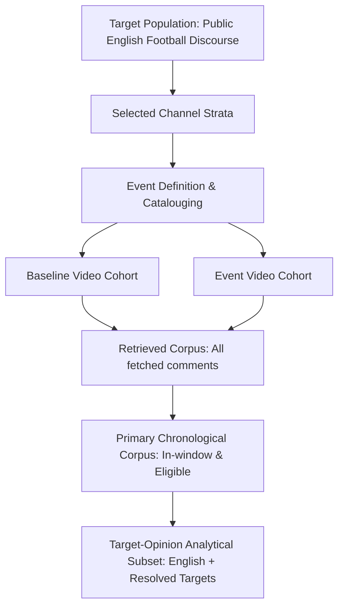

# Sampling Methodology

**Version**: 1.1
**Status**: Frozen for Version 1.1

> **Methodology Revision Notice**: Protocol Version 1.1 replaces the legacy single-axis channel stratum model with the formal Two-Axis Classification Taxonomy (Channel Type × Player Focus) defined in the Channel Stratification Protocol.

This document defines the exact analytical population and the specific criteria determining what observations belong in the study. We define the sample *before* retrieval rather than taking whatever the API happens to return. The integrity of our findings depends entirely on respecting these boundaries.

## 1. Sampling Principles
Findings describe observed associations within the documented sample. The methodology strictly avoids asserting causal effects, making claims about total global public opinion, or asserting true lifetime user behaviour outside the retrieved windows.

## 2. Sampling Flow

## 3. Analytical Population Definitions
- **Target Population**: Public English-language football discourse appearing on videos published by tracked channels and selected under the documented event and video-sampling rules.
- **Observed Sample**: Comments successfully retrieved from selected public YouTube videos according to this sampling protocol.

No extrapolations will be made to other platforms (e.g., X, Reddit) or unretrieved historical comments.

## 4. Terminology
- **Eligible**: A retrieved object satisfying every applicable inclusion rule and no exclusion rules.
- **Channels**: Pre-selected publishers of content.
- **Events**: Discrete temporal anchors (e.g., a match, an award).
- **Videos**: Specific media uploads related to an event.
- **Comments**: Textual reactions authored by YouTube users.

## 5. Channel Eligibility and Versioning
Channels are pre-selected based on their historical coverage orientation and audience profile to form distinct comparison strata. Under the Version 1.1 protocol, classification strictly follows the Two-Axis Model:

**Axis A: Channel Type**
- `BROAD_REACH_PUBLISHER`, `CLUB_MEDIA`, `ANALYSIS_PUBLISHER`, `INDEPENDENT_CREATOR`, `OTHER`, `UNCLASSIFIED`.

**Axis B: Player Focus**
- `MESSI_FOCUSED`, `RONALDO_FOCUSED`, `MIXED_FOCUS`, `NO_STRONG_DOMINANT_PLAYER_FOCUS`, `UNCLASSIFIED`.

Classification labels are assigned using only pre-event evidence and according to the versioned channel-stratification protocol. They are not based on the event under analysis.

*Rule*: Channel assignments are composite (Channel Type × Player Focus) and versioned (`dim_channel_stratum_version`). An event cannot retroactively alter a channel's stratum assignment for that event window, and assignments are explicitly pinned using `bridge_event_channel_stratum_snapshot`.

## 6. Event Selection
An **Event** is a discrete, defining moment in a player's career. Events are catalogued deterministically before retrieval begins. Each event must be entered into the versioned event catalogue before comment retrieval and must include:
- inclusion rationale
- event timestamp
- affected player or players
- anticipated video-publication window
- applicable channel strata
- exclusion risks or known confounders

Event metadata required for future comparison strata is captured in Version 1.0, while matched-event analysis itself is deferred to Version 1.x.

## 7. Baseline and Event Video Cohorts
To accurately measure audience dynamics (e.g., returning vs newly observed authors), we must sample two distinct video cohorts to ensure sufficient temporal coverage:
- **Baseline Video Cohort**: Videos published during the pre-event reference period (T-14 days to T-1 hour) that explicitly discuss the target player, relevant competition, or a pre-registered event-specific topic defined before comment retrieval. Every baseline video requires a documented inclusion rationale.
- **Event Video Cohort**: Videos published between T-24 hours and T+72 hours that explicitly discuss the event.

## 8. Video-Selection Algorithm
Eligible videos are ranked and selected using only pre-comment metadata. For every event, we select up to *K* videos per channel stratum using the following deterministic criteria (*K* is defined in a versioned sampling configuration and may vary by release, provided the same value is applied across comparable strata for a given event study):
1. Explicit event relevance.
2. Target-player relevance.
3. Publication-time proximity to the event.
4. Tracked-channel eligibility.
5. Deterministic tie-break using publication timestamp and video ID.

*Reproducibility Rule*: The complete ordered candidate list is stored before sampling so identical inputs reproduce identical video selections. Comment sentiment, volume, or content may not influence video selection.

## 9. Comment Retrieval Datasets
YouTube comment retrieval order dictates what we observe. We maintain two strictly separated samples:
1. **CHRONOLOGICAL SAMPLE** (Primary): Comments retrieved using `order=time`. Chronological retrieval preserves observed posting order and is therefore adopted as the project's primary temporal sampling strategy.
2. **RELEVANCE SAMPLE** (Audit): Comments retrieved using `order=relevance`. This is an auxiliary sample isolated for the algorithmic surfacing audit (RQ10) and is never mixed into the primary time-series.

## 10. Analytical Subsets
To prevent entity resolution failures from artificially reducing observed overall participation volume, we define three strict data levels:
- **Retrieved corpus**: All successfully retrieved comments. Used for completeness and API capacity metrics.
- **Primary chronological corpus**: Chronological, in-window comments satisfying source-level eligibility rules, regardless of detected language. Language filtering is applied only when constructing language-dependent analytical subsets. Used for general participation volume and author-ID coverage metrics.
- **Target-opinion analytical subset**: English comments with an accepted target resolution. Used for target-opinion metrics.

## 11. Event-Relative Windows
Discourse is captured across explicit temporal windows anchored to the event:
- **PRE_EVENT**: T-14 days to T-1 hour (Baseline).
- **EVENT**: T-1 hour to T+6 hours.
- **EARLY_POST_EVENT**: T+6 hours to T+24 hours.
- **LATE_POST_EVENT**: T+24 hours to T+72 hours.
- **RECOVERY_WINDOW**: T+72 hours to T+14 days.

## 12. Inclusion and Exclusion Rules
- **Non-English**: Videos and comments where the primary language is not English are excluded from target-opinion analysis.
- **YouTube Shorts**: Their algorithm and audience mechanics differ drastically from standard VODs; they are strictly excluded. Shorts classification follows a versioned detection rule and is stored with the exclusion reason.
- **Spam**: Exact duplicates and repeated phrases are retained by default for repetition and discourse analysis unless they satisfy a separately documented spam rule. Only clearly promotional or non-substantive content (e.g., repeated external-link solicitation or empty strings) is excluded automatically. Every excluded comment retains an exclusion reason, rule version, and original retrieval record.
- **Confidence Thresholds**: NLP filters (e.g., `language_confidence_threshold`, `target_resolution_threshold`, `spam_threshold`) are defined in versioned configurations and validated through labelled evaluation data. They are never hard-coded implicitly.

## 13. Analytical Window Caps
A configurable maximum number of comments per video per analytical window is applied. Each analytical window is divided into fixed time buckets, and comments are selected deterministically within each bucket using publication timestamp and source comment ID as tie-breakers. Additional retrieved comments remain stored but are excluded from the balanced analytical sample. This ensures a single viral video cannot mathematically dominate an entire event window.

Whenever comments are excluded by the per-window cap, the platform should store:
- `window_population_count`
- `window_selected_count`
- `selection_fraction`
- `time_bucket`
- `selection_rank`

## 14. Minimum Cohort Requirements
Minimum thresholds are defined separately by analytical use case rather than through one universal cohort threshold. An analysis is eligible only when it satisfies these minimum thresholds stored in the versioned sampling configuration for:
- eligible videos per channel stratum;
- comments per analytical window;
- target-opinion observations;
- stable author identifiers;
- represented channel strata.

Results failing these thresholds are marked `INSUFFICIENT_SAMPLE` and are not shown as headline findings.

## 15. Sampling Bias
Potential sources of bias include:
- tracked-channel selection
- English-language restriction
- public comments only
- deleted comments
- disabled comments
- YouTube moderation
- API quota limits
- creator upload behaviour
- unequal event media coverage

These biases are measured where possible and disclosed alongside analytical outputs rather than assumed negligible.

## 16. Overlapping-Event Handling
A comment may fall into multiple event windows. A comment may retain links to multiple candidate events in a bridge or feature layer, but event-level aggregate marts use one accepted primary-event association by default. 

A primary event is assigned only when:
- the minimum association threshold is met; and
- the margin over the second-highest event exceeds a configured threshold.

Comments with ambiguous event attribution are excluded from event-specific headline metrics and retained for audit.

## 17. Manual Overrides
Manual overrides (e.g., handling duplicate uploads, mirrored videos, livestreams, deleted videos) are permitted only when documented. Each override records:
- reason
- timestamp
- operator
- affected object

## 18. Versioning and Audit Fields
All sampling decisions are explicitly stored alongside the retrieved data in the data warehouse to support reproducibility from preserved raw inputs and versioned transformation logic. Every analytical record should be traceable to:
- `sampling_policy_version`
- `channel_stratum_version`
- `event_catalogue_version`
- `language_model_version`
- `target_resolution_model_version`
- `analytical_inclusion_rule_version`
- `event_association_model_version`
- `spam_rule_version`
- `video_selection_policy_version`
- `retrieval_run_id`

## 19. Methodological Boundary
This document governs observation selection and analytical inclusion only. API pagination, retries, checkpointing, quota execution, and raw-response persistence are defined separately in the ingestion methodology. Metric formulas and uncertainty calculations are defined in the metric dictionary.
