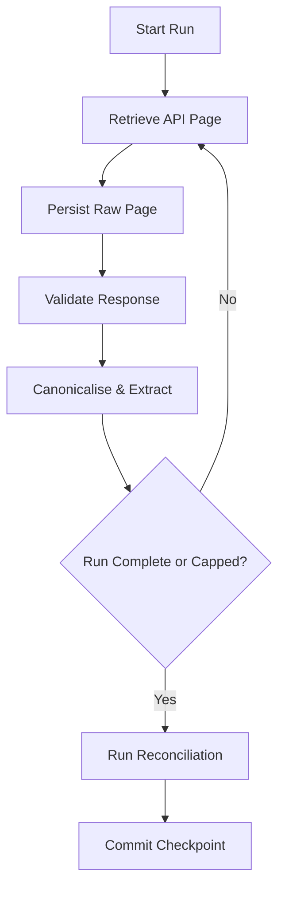

# Ingestion Methodology

This document details the physical API mechanics, quota management, and retrieval algorithms used to ingest data for the Football Narrative Observatory. It answers exactly *how* the observations defined in the Sampling Methodology are retrieved.

## 1. Ingestion Contract
The ingestion layer must:
- preserve immutable source responses;
- support idempotent reprocessing;
- detect incomplete retrieval;
- enforce quota budgets;
- expose run-level lineage and failure states.

The ingestion layer does not:
- perform sentiment classification;
- decide final analytical inclusion;
- overwrite historical source observations;
- claim complete retrieval where continuity cannot be established.

## 2. Ingestion Lifecycle

## 3. Source Endpoints
- `search.list`: Periodic video discovery for new events; isolated because of its separate daily search quota.
- `videos.list`: Batched video metadata and statistics retrieval.
- `channels.list`: Channel metadata validation and tracked-channel refresh.
- `commentThreads.list`: The primary ingestion endpoint. Retrieves top-level comments and basic thread metadata for a given `videoId`.
- `comments.list`: Used for retrieving full replies to a specific parent comment.

## 4. Run Grain and Identifiers
One ingestion run represents:
`source × endpoint × resource scope × retrieval mode × sample type × execution attempt`

Where `resource scope` may be:
- one video;
- a batch of video IDs;
- one channel;
- one search query;
- one parent comment.

Endpoint-specific scope fields are stored separately.

Every run records:
- `ingestion_run_id`
- `retrieval_mode`
- `sample_type`
- `started_at`
- `completed_at`
- `pages_requested`
- `pages_succeeded`
- `comments_observed`
- `new_comments_inserted`
- `duplicate_comments_observed`
- `estimated_quota_consumed`
- `run_outcome`
- `scan_status`
- `error_code`

Run outcome describes the simple operational state:
- `SUCCESS`
- `PARTIAL`
- `FAILED`
- `SKIPPED`

## 5. Initial-Load Algorithm
For a newly tracked video with no prior checkpoint:
- begin at page one;
- retrieve up to the configured initial-load cap;
- stop when the analytical lower-bound timestamp is crossed or no page remains;
- classify the scan as complete or capped;
- create the first committed watermark only after successful persistence.

## 6. Incremental Chronological Algorithm
Top-level comment retrieval is capped at a configured number of pages or comments per video per ingestion run. Because the YouTube API (`commentThreads.list`) does not support a `publishedAfter` filter, timestamp filtering must happen inside our ingestion service after retrieval. 

Each incremental run begins from the newest page (`order=time`) and proceeds backward until the stored composite watermark is reached or the run cap is met.

## 7. Composite Watermark Rules
The ingestion service tracks state using:
- `committed_watermark_at`
- `committed_watermark_comment_ids`
- `candidate_watermark_at`
- `candidate_watermark_comment_ids`
- `watermark_committed_at`

The candidate watermark for a successful chronological run is the newest fully persisted comment timestamp observed in that run, together with all source comment IDs observed at that timestamp.

The normal scan stops only when:
1. all comments at the committed watermark timestamp have been encountered; and
2. the next observed comment has `published_at < committed_watermark_at`.

Because the API does not support `publishedAfter`, the overlap is client-side. The ingestion service may continue past the committed watermark by a configured duration (`watermark_overlap_seconds`) or number of pages, followed by ID-based deduplication.

*Rule*: Do not advance the committed watermark when the run is capped before reaching continuity. Update only after a successful run. An empty successful run does not advance the committed watermark.

## 8. Raw-Page Persistence
Every successful API response page is persisted immutably *before* parsing with:
- request parameters;
- retrieval timestamp;
- endpoint;
- HTTP status;
- page token used;
- next-page token returned;
- complete JSON payload;
- payload hash;
- ingestion run ID.

## 9. Response Validation
Each persisted page is validated for:
- expected endpoint structure;
- required identifiers;
- parseable timestamps;
- valid pagination fields;
- malformed or missing item payloads.

Malformed items are quarantined with the raw page reference and do not prevent valid sibling items from being processed unless the page itself is unusable.

## 10. Canonicalisation and Idempotency
We distinguish between different observation grains:
- **Raw page observation**: One API response page.
- **Comment observation**: One comment observed in one retrieval run.
- **Canonical comment**: One logical source comment ID.
- **Comment text version**: One distinct observed text/hash state.
- **Engagement snapshot**: One observed like/reply count at a timestamp.

**Idempotency Rules**:
- Reprocessing the same raw page must not create duplicate canonical comments.
- A repeated `source_comment_id` with the same text hash creates no new text version.
- A repeated `source_comment_id` with a changed text hash creates a new comment-text version.
- Engagement changes create a new snapshot rather than overwriting history.
- Repeated sample observations are retained only at the observation grain.

## 11. Capped-Run and Gap Handling
A viral video may generate more than the configured run cap between runs, meaning the current pages never reach the prior watermark. A stored `nextPageToken` is treated as a best-effort continuation hint, not a durable historical offset. 

Backfill always performs canonical deduplication and gap detection. If continuity cannot be established, the affected interval remains `GAP_UNRESOLVED`.

Continuity status tracking:
- `COMPLETE_TO_WATERMARK`
- `CAPPED_BEFORE_WATERMARK`
- `POTENTIAL_GAP`
- `GAP_UNRESOLVED`

## 12. Backfill State Machine
Backfill state is tracked independently of the scan status. A video can be `CAPPED_BEFORE_WATERMARK` while a backfill is still in progress.

Statuses:
- `NOT_REQUIRED`
- `QUEUED`
- `IN_PROGRESS`
- `PARTIALLY_RECOVERED`
- `GAP_CLOSED`
- `FAILED`
- `ABANDONED`

Fields:
- `backfill_run_id`
- `originating_hot_path_run_id`
- `gap_start_at`
- `gap_end_at`
- `oldest_recovered_at`
- `backfill_status`

## 13. Relevance-Audit Retrieval
Relevance retrieval (`order=relevance`):
- uses a distinct checkpoint and run type;
- never updates chronological watermarks;
- stores sample-observation rank and retrieval timestamp;
- is isolated from primary chronological marts;
- uses the same fixed video universe and comparable retrieval period where possible.

## 14. Reply Policy
Top-level comments form the primary MVP corpus. Attempted complete reply retrieval requires one or more paginated `comments.list(parentId=...)` calls and remains subject to deletion, availability, and quota constraints. We retrieve replies only for selected high-value threads or defer to Phase 2.

## 15. Retry and Failure Policy
Retryable errors:
- transient 5xx responses;
- connection timeouts;
- rate-limit responses where retry timing is available.

Non-retryable or terminal conditions:
- comments disabled;
- video unavailable;
- invalid video ID;
- permission errors.

Retries use bounded exponential backoff with jitter. Every attempt is recorded. A run is never marked complete if a required page failed.

Source availability tracking:
- `AVAILABLE`
- `NO_COMMENTS`
- `COMMENTS_DISABLED`
- `VIDEO_UNAVAILABLE`
- `ACCESS_RESTRICTED`

## 16. Dead-Letter and Replay Policy
Failed records are stored with:
- raw response reference;
- source record ID where available;
- ingestion run ID;
- processing stage;
- error code;
- error message;
- first failure timestamp;
- retry count;
- resolution status.

Dead-letter records may be replayed after code or schema corrections without re-calling the API.

## 17. Quota Accounting
Every request records:
- `quota_bucket`
- `configured_quota_limit`
- `estimated_quota_cost`
- `estimated_quota_consumed`
- `remaining_estimated_quota`
- `quota_reset_at`
- `request_count`

Quota budgets are configuration-driven. The project receives separate API quota buckets: general queries (10,000/day) and YouTube Search Queries (100 search calls/day).

### Search Fallback Quota Management & Resumable Discovery
- **Call Accounting**: `search.list` consumes 1 Search Query per call from the separate YouTube Search Queries bucket (default 100 search queries/day). Pagination requests (`nextPageToken`) count as additional search query calls.
- **Process Call Budget**: Process executions operate under a `run_search_call_budget` parameter limiting calls per execution without assuming exclusive project-level quota.
- **Pre-run Call Metrics**: Calculates `minimum_required_calls` (count of uncompleted initial query pages) prior to API execution.
- **Page-Level Token Checkpointing**: State is stored in `OPS.DISCOVERY_UNIT_STATE` tracking `(frame_version_key, channel_key, window_key, discovery_policy_version, query_hash)`. Mid-batch halts persist `next_page_token` and `pages_completed`, allowing subsequent runs to resume pagination directly.
- **HTTP 429 Handling**: API quota errors (HTTP 429 / `quotaExceeded`) are caught non-destructively, persisting completed page progress and setting run status to `PARTIAL_QUOTA_LIMIT`.
- **Set-Based Completeness Audit**: Historical frame discovery status becomes `COMPLETE` if and only if `REMAINING_UNITS == 0` (where `REMAINING_UNITS = len(EXPECTED_UNITS - COMPLETED_UNITS)`). Partial runs set status `PARTIAL_QUOTA_LIMIT` and strictly prohibit universe promotion.

## 18. Checkpoint Transaction Rules
Checkpoint advancement occurs only after:
1. raw API pages are durably persisted;
2. comment observations are written;
3. canonical deduplication succeeds;
4. run reconciliation passes.

Run reconciliation verifies that:
- every successful API page has a persisted raw-page record;
- observed comment counts reconcile with parsed item counts;
- failed items are represented in the dead-letter store;
- canonical writes and snapshot writes completed;
- the run has no unresolved required-page failure;
- recorded request and page counts are internally consistent.

If any step fails, the prior committed checkpoint remains unchanged.

## 19. Security and Secret Handling
The ingestion layer temporarily handles raw author IDs before HMAC pseudonymisation.
- raw author IDs are not logged;
- secrets are loaded from environment or secret manager;
- raw payload access is restricted;
- HMAC conversion happens before core analytical storage;
- API keys never enter response payloads or logs.

## 20. Observability Metrics
At minimum, the pipeline monitors:
- `request_success_rate`
- `pages_per_run`
- `comments_per_page`
- `new_comment_rate`
- `duplicate_observation_rate`
- `author_id_coverage`
- `watermark_lag_minutes`
- `backfill_queue_depth`
- `quota_consumption_rate`
- `run_duration_seconds`

## 21. Methodological Boundary
This document governs API pagination, retries, checkpointing, quota execution, and raw-response persistence. Observation selection and analytical inclusion are defined separately in the sampling methodology. Metric formulas and uncertainty calculations are defined in the metric dictionary.
