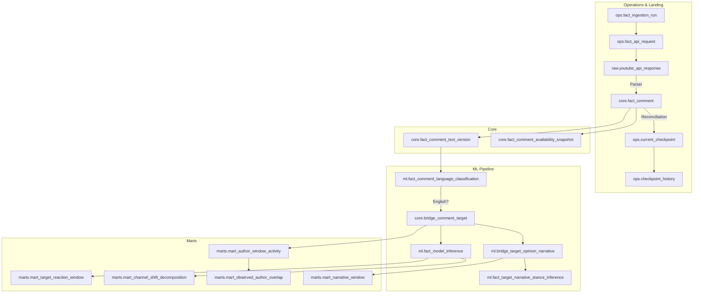

# Data Warehouse Design

## 1. Design Principles
This physical schema is designed backwards from the frozen methodology and metric definitions, not forwards from the API. It enforces strict dimensional modeling rules:
- **Immutable History**: Source history (comment text, engagement, language classification) is preserved via Type-2 style versioning and snapshotting, rather than destructively overwritten.
- **Methodological Precedence**: Operational constraints defined in the ADD, Ingestion Methodology, and Metric Definitions strictly govern table structures.
- **Reproducibility**: All models, taxonomy versions, sampling policies, and salt configurations are permanently preserved in dimension records.

## 2. Layer Architecture
Version 1.0 uses five schemas; Version 1.x may introduce the optional `features` schema.
1. **`raw`**: Immutable API payload landing zone.
2. **`ops`**: Telemetry for ingestion, quota, checkpoints, and backfills.
3. **`core`**: Conformed dimensions, immutable root facts, and resolution bridges.
4. **`ml`**: Model inference runs, predictions, and evidence spans.
5. **`marts`**: Pre-aggregated analytical objects directly mapped to the V1.0 metric dictionary.

---

## 3. Raw Schema
Satisfies the ingestion contract for immutable source preservation.

### `raw.youtube_api_response`
- **Purpose**: Persist raw API pages to enable idempotent reprocessing and auditing before parser intervention.
- **Mutation Policy**: Append only.
- **Grain**: One API response page per API request attempt.
- **Primary Key**: `raw_response_id` (Surrogate)
- **Natural Key**: `api_request_id`
- **Fields**:
  - `ingestion_run_id`, `api_request_id`
  - `source_system`, `endpoint`, `resource_scope_type`, `resource_scope_id`
  - `video_source_id`, `parent_comment_source_id`
  - `request_parameters`, `http_status`
  - `page_token_used`, `next_page_token_returned`
  - `retrieved_at`
  - `raw_json_payload` (VARIANT), `payload_hash`
  - `parser_version`, `source_schema_version`
- **Constraints**: `UNIQUE(api_request_id)`. `api_request_id` references `ops.fact_api_request`; `ingestion_run_id` references `ops.fact_ingestion_run`. Page tokens are nullable; `payload_hash` is required.

---

## 4. Operational Schema
Tracks ingestion grain matching the methodology.

### `ops.fact_ingestion_run`
- **Mutation Policy**: Append only.
- **Grain**: One execution attempt per resource scope parameter set.
- **Primary Key**: `ingestion_run_id` (Surrogate)
- **Natural Key**: `source_system`, `endpoint`, `resource_scope_type`, `resource_scope_id`, `retrieval_mode`, `sample_type`, `execution_attempt`
- **Fields**: `source_system`, `endpoint`, `resource_scope_type`, `resource_scope_id`, `retrieval_mode`, `sample_type`, `execution_attempt`, `started_at`, `completed_at`, `pages_requested`, `pages_succeeded`, `records_observed`, `records_inserted`, `duplicate_records_observed`, `estimated_quota_consumed`, `error_code`, `run_outcome` (`SUCCESS`, `PARTIAL`, `FAILED`), `continuity_status`, `source_availability_status`, `backfill_status`.

### `ops.fact_api_request`
- **Mutation Policy**: Append only.
- **Grain**: One HTTP request within a run.
- **Primary Key**: `api_request_id` (Surrogate)
- **Natural Key**: `ingestion_run_id`, `requested_at`
- **Fields**: `ingestion_run_id`, `endpoint`, `requested_at`, `completed_at`, `http_status`, `page_token_used`, `next_page_token_returned`, `retry_number`, `error_code`, `estimated_quota_cost`.

### `ops.current_checkpoint`
- **Purpose**: Stores the committed incremental frontier and active retrieval state.
- **Mutation Policy**: Type 1 (Overwrite).
- **Grain**: One checkpoint per resource scope $\times$ sample type.
- **Primary Key**: `checkpoint_id` (Surrogate)
- **Natural Key**: `source_system`, `endpoint`, `resource_scope_type`, `resource_scope_id`, `retrieval_mode`, `sample_type`
- **Fields**: `committed_watermark_at`, `candidate_watermark_at`, `last_complete_scan_at`, `continuation_token_hint`, `current_continuity_state`, `checkpoint_transaction_lineage`, `updated_at`.

### `ops.checkpoint_history`
- **Mutation Policy**: Append only (Audit).
- **Grain**: One checkpoint update per resource scope $\times$ sample type.
- **Primary Key**: `checkpoint_history_id` (Surrogate)
- **Natural Key**: `checkpoint_id`, `updated_at`
- **Fields**: `checkpoint_id`, `committed_watermark_at`, `candidate_watermark_at`, `last_complete_scan_at`, `continuation_token_hint`, `current_continuity_state`, `checkpoint_transaction_lineage`, `updated_at`.

### `ops.current_watermark_comment`
- **Mutation Policy**: Type 1 (Overwrite transactional replacement).
- **Grain**: One comment ID $\times$ watermark type $\times$ checkpoint.
- **Fields**: `checkpoint_id`, `source_comment_id`, `watermark_type` (`COMMITTED`, `CANDIDATE`).

### `ops.checkpoint_watermark_comment_history`
- **Mutation Policy**: Append only.
- **Grain**: One comment ID $\times$ watermark type $\times$ checkpoint history state.
- **Fields**: `checkpoint_history_id`, `source_comment_id`, `watermark_type`.

### Additional Ops Tables
- **`ops.fact_channel_classification_assessment`**: Append-only log of all periodic reassessments, capturing exact evidence/confidence metrics regardless of whether a Type-2 shift occurs.
- **`ops.fact_backfill_job`**: Tracks gap-resolution runs.
- **`ops.dead_letter_record`**: Failed parsing or validation records.
- **`ops.manual_override`**: Documented analyst interventions, tracked via `override_id`.
- **`ops.unmapped_entity_audit`**: High-frequency unresolved phrases/nicknames.

---

## 5. Core Dimensions
Every referenced foreign key points to a valid dimension.

### `core.dim_date` & `core.dim_time`
Standard calendar dimensions for temporal aggregation.

### `core.dim_channel`
- **Purpose**: Identity mapping for content creators/channels.
- **Mutation Policy**: Append only.
- **Grain**: One source channel per system.
- **Primary Key**: `channel_key`
- **Natural Key**: `source_system`, `source_id`
- **Fields**: `source_system`, `source_id`, `channel_name`.

### `core.dim_video`
- **Purpose**: Identity mapping and stable sampling traits for videos.
- **Mutation Policy**: Append only.
- **Grain**: One video per system.
- **Primary Key**: `video_key`
- **Natural Key**: `source_system`, `source_id`
- **Fields**: `channel_key`, `source_system`, `source_id`, `published_at`, `duration_seconds`, `is_short`, `short_classification_rule_version`, `primary_language_code`, `content_type`, `first_observed_at`.

### `core.dim_author`
- **Purpose**: Privacy-safe identity reference.
- **Mutation Policy**: Append only.
- **Grain**: One pseudonymised source author identity per salt version.
- **Primary Key**: `author_key` (Surrogate)
- **Natural Key**: `author_hash`, `salt_version_id`
- **Fields**: `author_hash`, `salt_version_id`.

### `core.dim_event`
- **Purpose**: The immutable identity root for an event.
- **Mutation Policy**: Append only.
- **Grain**: One specific stable event identity.
- **Primary Key**: `event_key`
- **Natural Key**: `external_event_id`
- **Fields**: `external_event_id`, `event_type`.

### `core.dim_event_version`
- **Purpose**: Stores mutable characteristics of an event over time.
- **Mutation Policy**: Type 2.
- **Grain**: One specific event version interpretation.
- **Primary Key**: `event_version_key` (Surrogate)
- **Natural Key**: `event_key`, `valid_from`
- **Fields**: `event_key`, `event_name`, `occurred_at`, `inclusion_rationale`, `valid_from`, `valid_to`, `is_current`.

### `core.dim_event_window`
- **Purpose**: Defines analytical windows relative to an event version.
- **Mutation Policy**: Type 2.
- **Grain**: One analytical window per event version.
- **Primary Key**: `window_key` (Surrogate)
- **Natural Key**: `event_version_key`, `window_type`
- **Fields**: `event_version_key`, `event_catalogue_version_key`, `window_definition_version_key`, `window_type` (`PRE_EVENT`, `EVENT`, `EARLY_POST_EVENT`, `LATE_POST_EVENT`, `RECOVERY_WINDOW`), `window_sequence`, `relative_offset_start`, `relative_offset_end`, `absolute_start_at`, `absolute_end_at`.

### `core.dim_target_entity`
- **Purpose**: Standardised identity for analytical targets (e.g. players, managers).
- **Mutation Policy**: Append only.
- **Grain**: One analytical target entity.
- **Primary Key**: `target_entity_key`
- **Natural Key**: `wikidata_id` (or primary stable reference)
- **Fields**: `entity_name`, `entity_type`, `wikidata_id`, `transfermarkt_id`.

### `core.dim_target_entity_alias`
- **Mutation Policy**: Type 2.
- **Fields**: `alias_key` (PK), `target_entity_key`, `alias_text`, `alias_type`, `valid_from`, `valid_to`, `is_active`, `source`, `review_status`.

### `core.dim_channel_stratum`
- **Purpose**: Master definition of a composite channel grouping stratum (Channel Type × Player Focus).
- **Mutation Policy**: Append only.
- **Grain**: One composite stratum definition.
- **Primary Key**: `stratum_key`
- **Natural Key**: `channel_type_value`, `player_focus_value`
- **Fields**: `channel_type_value`, `player_focus_value`, `stratum_name`, `analytical_eligibility`.

### `core.dim_channel_stratum_version`
- **Purpose**: Historically accurate assignment of a channel to a composite stratum.
- **Mutation Policy**: Type 2.
- **Grain**: One historical assignment per channel per composite stratum.
- **Primary Key**: `stratum_version_key` (PK)
- **Natural Key**: `channel_key`, `stratum_key`, `valid_from`
- **Fields**: `channel_key`, `stratum_key`, `valid_from`, `valid_to`, `is_current`. (Note: Detailed evidence metrics are logged in `ops.fact_channel_classification_assessment` and pinned via `bridge_event_channel_stratum_snapshot`).

### Configuration Dimensions
- **`core.dim_model_version`**: `model_version_key`, `model_name`, `task_name`, `model_type`, `provider`, `checkpoint`, `prompt_version`, `training_data_version`, `label_schema_version`, `threshold_config_version`, `code_commit_sha`, `created_at`, `retired_at`.
- **`core.dim_model_bundle_version`**: `model_bundle_version_key` (PK), `bundle_name`, `valence_model_version_key`, `derision_model_version_key`, `toxicity_model_version_key`, `sarcasm_model_version_key`, `target_resolution_model_version_key`, `language_model_version_key`, `narrative_model_version_key`, `stance_model_version_key`, `threshold_config_version_key`, `valid_from`, `valid_to`.
- **`core.dim_construct`**: `construct_key` (PK), `construct_name` (e.g. `VALENCE`, `TOXICITY`), `description`.
- **`core.dim_taxonomy_version`**: `taxonomy_version_key`, `taxonomy_name`, `taxonomy_version`, `valid_from`, `valid_to`, `definition_hash`, `created_at`, `retired_at`, `code_commit_sha`.
- **`core.dim_sampling_policy_version`**: Versioning for selection heuristics.
- **`core.dim_event_catalogue_version`**: Versioning for the event dictionary.
- **`core.dim_threshold_config_version`**: Versioning for tuning thresholds.

### `core.dim_narrative_family` & `core.dim_narrative_instance`
- **Family**: `narrative_family_key`, `family_name`, `family_description`.
- **Instance**: `narrative_instance_key`, `taxonomy_version_key`, `canonical_name`, `semantic_definition`, `origin_event_version_key`, `originated_at`.

### `core.dim_comparison_stratum`
- **Purpose**: Baseline matching groupings replacing heuristic scores.

---

## 6. Core Facts (Comment Identity & History)

### `core.fact_comment`
- **Purpose**: Immutable identity for a source comment.
- **Mutation Policy**: Append only.
- **Grain**: One logical source comment per system.
- **Primary Key**: `comment_key` (Surrogate)
- **Natural Key**: `source_system`, `source_comment_id`
- **Fields**: `video_key`, `parent_comment_key`, `author_key`, `published_at`, `first_observed_at`, `is_reply`.

### `core.fact_comment_availability_snapshot`
- **Mutation Policy**: Append only.
- **Grain**: One comment × one observation timestamp.
- **Primary Key**: `availability_snapshot_key` (Surrogate)
- **Natural Key**: `comment_key`, `observed_at`
- **Fields**: `availability_status` (`AVAILABLE`, `DELETED`, `HIDDEN`, `UNAVAILABLE`, `UNKNOWN`), `source_error_reason`, `ingestion_run_id`.

### `core.fact_comment_text_version`
- **Mutation Policy**: Append only.
- **Grain**: One logical comment × one distinct observed text version.
- **Primary Key**: `text_version_key` (Surrogate)
- **Natural Key**: `comment_key`, `text_hash`
- **Fields**: `text_content`, `source_updated_at`, `observed_at`, `is_latest_version`.

### `core.fact_comment_engagement_snapshot`
- **Mutation Policy**: Append only.
- **Grain**: One logical comment × one observation timestamp.
- **Primary Key**: `engagement_snapshot_key` (Surrogate)
- **Natural Key**: `comment_key`, `observed_at`
- **Fields**: `likes`, `reply_count`, `ingestion_run_id`.

### `core.fact_video_snapshot`
- **Mutation Policy**: Append only.
- **Grain**: One video × one observation timestamp.
- **Primary Key**: `video_snapshot_key` (Surrogate)
- **Natural Key**: `video_key`, `observed_at`
- **Fields**: `title`, `description`, `views`, `likes`, `observed_at`, `ingestion_run_id`.

---

## 7. Core Bridges

### `core.bridge_event_entity`
- **Purpose**: Resolves exactly which entities are central to an event version.
- **Mutation Policy**: Append only.
- **Grain**: One event version × one target entity × one entity role.
- **Primary Key**: `event_entity_key` (Surrogate)
- **Natural Key**: `event_version_key`, `target_entity_key`, `entity_role`
- **Fields**: `event_version_key`, `target_entity_key`, `entity_role`.

### `core.bridge_video_event`
- **Purpose**: Determines if a video is included in the analytical universe of an event.
- **Mutation Policy**: Append only.
- **Grain**: One video × one event version × one sampling policy version.
- **Primary Key**: `video_event_key` (Surrogate)
- **Natural Key**: `video_key`, `event_version_key`, `sampling_policy_version_key`
- **Fields**: `cohort_type`, `selection_rank`, `inclusion_status`, `inclusion_rationale`, `candidate_list_lineage`, `override_id`.

### `core.bridge_comment_event`
- **Purpose**: Predicts if a comment specifically relates to an event.
- **Mutation Policy**: Append only.
- **Grain**: One text version × one candidate event version × one association model version.
- **Primary Key**: `comment_event_key` (Surrogate)
- **Natural Key**: `text_version_key`, `event_version_key`, `association_model_version_key`
- **Fields**: `association_method`, `association_score`, `time_distance`, `is_primary_event`, `classification_status`, `margin_over_second_best`.

### `core.bridge_comment_sample_observation`
- **Purpose**: Explicit raw-to-core row lineage tracing.
- **Mutation Policy**: Append only.
- **Grain**: One comment × one raw response page observation.
- **Primary Key**: `comment_sample_observation_key` (Surrogate)
- **Natural Key**: `comment_key`, `raw_response_id`, `source_item_position`
- **Fields**: `comment_key`, `ingestion_run_id`, `api_request_id`, `raw_response_id`, `sample_type`, `page_number`, `rank_position`, `source_item_position`, `observed_at`.

### `core.bridge_event_comparison_stratum`
- **Purpose**: Baseline matching group association.
- **Mutation Policy**: Append only.
- **Grain**: One event version × one target entity × one comparison stratum.
- **Primary Key**: `event_comparison_stratum_key`
- **Natural Key**: `event_version_key`, `target_entity_key`, `comparison_stratum_key`

### `core.bridge_event_channel_stratum_snapshot`
- **Purpose**: Explicitly freezes the assignment used by each event analysis, guarding against retrospective reclassifications.
- **Mutation Policy**: Append only.
- **Grain**: One event version × one channel × one classification protocol version.
- **Primary Key**: `event_channel_stratum_snapshot_key` (Surrogate)
- **Natural Key**: `event_version_key`, `channel_key`, `classification_protocol_version`
- **Fields**: `channel_type_value`, `player_focus_value`, `channel_type_confidence`, `player_focus_confidence`, `reference_period_start`, `reference_period_end`, `effective_window_days`, `eligible_video_count`, `messi_video_count`, `ronaldo_video_count`, `messi_prevalence`, `ronaldo_prevalence`, `focus_ratio`, `fallback_used`, `override_id`.

### `core.bridge_comment_target`
- **Purpose**: Explicitly separates entity resolution from opinion inference.
- **Mutation Policy**: Append only.
- **Grain**: One comment text version × one target entity × one target-resolution model version.
- **Primary Key**: `comment_target_key` (Surrogate)
- **Natural Key**: `text_version_key`, `target_entity_key`, `target_resolution_model_version_key`
- **Fields**: `resolution_method`, `confidence`, `classification_status`, `is_primary_target`.

---

## 8. Inference and Evidence Model (`ml` schema)
Inference is separated from the immutable core facts to cleanly separate model interpretation from source observation.

### `ml.fact_model_inference_run`
- **Purpose**: Tracks operational telemetry and lineage of inference batches.
- **Mutation Policy**: Append only.
- **Grain**: One discrete API call/inference batch.
- **Primary Key**: `inference_run_id` (Surrogate)
- **Fields**: `model_version_key`, `provider`, `git_commit`, `docker_image`, `environment`, `prompt_hash`, `temperature`, `top_p`, `token_usage`, `latency_ms`, `retries`, `run_started_at`, `run_completed_at`, `run_outcome`, `subjects_requested`, `subjects_succeeded`, `subjects_failed`, `error_code`, `estimated_cost`.

### `ml.fact_comment_language_classification`
- **Mutation Policy**: Append only.
- **Grain**: One inference run × one text version.
- **Primary Key**: `language_key` (Surrogate)
- **Natural Key**: `inference_run_id`, `text_version_key`
- **Fields**: `language_code`, `confidence`, `classification_status`.

### `ml.fact_model_inference`
- **Purpose**: Long-form construct-value inference storage for valence, derision, toxicity, and sarcasm.
- **Mutation Policy**: Append only.
- **Grain**: One inference run $\times$ one subject (`comment_target_key`) $\times$ one construct (`construct_key`).
- **Primary Key**: `inference_key` (Surrogate)
- **Natural Key**: `inference_run_id`, `subject_key`, `construct_key`
- **Fields**: `inference_run_id`, `subject_type` (e.g. 'TARGET_OPINION'), `subject_key`, `construct_key`, `predicted_label`, `score`, `confidence`, `classification_status`, `processed_at`.

### `ml.bridge_target_opinion_narrative`
- **Purpose**: Maps target opinions to specific narratives based on an inference output.
- **Mutation Policy**: Append only.
- **Grain**: One resolved comment-target association (`comment_target_key`) × one narrative inference run (`narrative_inference_run_id`) × one narrative instance (`narrative_instance_key`).
- **Primary Key**: `narrative_assignment_key` (Surrogate)
- **Natural Key**: `comment_target_key`, `narrative_inference_run_id`, `narrative_instance_key`
- **Fields**: `narrative_assignment_key`, `comment_target_key`, `narrative_inference_run_id`, `narrative_instance_key`, `is_primary_assignment`, `assignment_confidence`, `classification_status`, `processed_at`.

### `ml.fact_target_narrative_stance_inference`
- **Purpose**: Stance requires both the target opinion and narrative claim as inputs.
- **Mutation Policy**: Append only.
- **Grain**: One stance inference run (`stance_inference_run_id`) × one source narrative assignment (`source_narrative_assignment_key`).
- **Primary Key**: `stance_key` (Surrogate)
- **Natural Key**: `stance_inference_run_id`, `source_narrative_assignment_key`
- **Fields**: `stance_inference_run_id`, `source_narrative_assignment_key`, `stance_label` (`SUPPORTS`, `OPPOSES`), `confidence`, `classification_status`.

### `ml.bridge_model_evidence_span`
- **Purpose**: Evidence spans for a general construct inference output.
- **Mutation Policy**: Append only.
- **Grain**: One inference output (`inference_key`) × one evidence span index.
- **Primary Key**: `model_evidence_span_key` (Surrogate)
- **Natural Key**: `inference_key`, `evidence_span_index`
- **Fields**: `inference_key`, `evidence_span_index`, `text_version_key`, `character_offset_standard`, `evidence_start`, `evidence_end`, `evidence_text`.

### `ml.bridge_stance_evidence_span`
- **Purpose**: Evidence spans strictly separated for stance outputs to avoid polymorphism.
- **Mutation Policy**: Append only.
- **Grain**: One stance inference output (`stance_key`) × one evidence span index.
- **Primary Key**: `stance_evidence_span_key` (Surrogate)
- **Natural Key**: `stance_key`, `evidence_span_index`
- **Fields**: `stance_key`, `evidence_span_index`, `text_version_key`, `character_offset_standard`, `evidence_start`, `evidence_end`, `evidence_text`.

### `features.comment_feature` (Deferred to V1.x)
- **Purpose**: Reusable embeddings, emotion vectors, or topical representations, separated from direct classifier inferences.

---

## 9. Mart Layer
Denormalised outputs structured specifically to serve the Metric Dictionary. Every mart contains necessary configuration lineage fields (e.g., `model_bundle_version_key`, `taxonomy_version_key`, `threshold_config_version_key`, `sampling_policy_version_key`, `data_as_of_at`).

### Coverage Marts
- **`marts.mart_methodology_coverage_event_window`**: Grain: `event_version_key` $\times$ `window_key`. Covers M001–M004, M006, M030.
- **`marts.mart_complete_window_coverage_stratum`**: Grain: `event_version_key` $\times$ `window_key` $\times$ `stratum_key`. Covers M005.
- **`marts.mart_classifier_output_coverage`**: Grain: `event_version_key` $\times$ `window_key` $\times$ `construct_key`. Covers M007.

### Analytical Marts
- **`marts.mart_target_reaction_window`**: Grain: `event_version_key` × `target_entity_key` × `window_key`.
  - **Explicit Denominators**: `eligible_target_opinion_count`, `accepted_valence_output_count`, `accepted_derision_output_count`, `accepted_toxicity_output_count`, `accepted_sarcasm_output_count`.
- **`marts.mart_video_balanced_reaction`**: Grain: `event_version_key` × `target_entity_key` × `window_key` (M009).
- **`marts.mart_model_comparison`**: Grain: `event_version_key` × `window_key` × `construct_key` × model pair (M014).
- **`marts.mart_author_window_activity`**: Grain: `event_version_key` × `target_entity_key` × `author_key` × `window_key`. (Derived fields: `observed_comment_count`, `observed_channel_count`, `mean_target_valence`, `first_observed_at`).
- **`marts.mart_observed_author_overlap`**: Grain: `event_version_key` × `target_entity_key` × window pair (M016, M017).
- **`marts.mart_returning_author_shift`**: Grain: `event_version_key` × `target_entity_key` × window pair (M018).
- **`marts.mart_channel_shift_contribution`**: Grain: `event_version_key` × `target_entity_key` × channel stratum × window pair.
- **`marts.mart_channel_shift_decomposition`**: Grain: `event_version_key` × `target_entity_key` × window pair. Enforces M019 + M020 = shift.
- **`marts.mart_stratum_adjusted_reaction`**: Grain: `event_version_key` × `target_entity_key` × channel stratum (M021).
- **`marts.mart_narrative_window`**: Grain: `event_version_key` × `target_entity_key` × `narrative_instance_key` × `window_key`. 
  - **Explicit Denominators**: `eligible_target_opinion_count`, `accepted_primary_narrative_count`, `narrative_assignment_count`, `accepted_stance_assignment_count`, `eligible_stance_assignment_count`.

---

## 10. Metric-to-Mart Traceability Matrix

| Metric ID | Metric Name | Mart Dependency |
|-----------|-------------|-----------------|
| M001–004, M006 | Pipeline Coverages | `mart_methodology_coverage_event_window` |
| M005 | Stratum Coverage | `mart_complete_window_coverage_stratum` |
| M007 | Classifier Coverage | `mart_classifier_output_coverage` |
| M030 | Analytical Retention | `mart_methodology_coverage_event_window` |
| M008, M010–13 | Target Reaction | `mart_target_reaction_window` |
| M009 | Video-Balanced Reaction | `mart_video_balanced_reaction` |
| M014 | Model Disagreement | `mart_model_comparison` |
| M016, M017 | Author Overlap | `mart_observed_author_overlap` |
| M018 | Tone Shift | `mart_returning_author_shift` |
| M019, M020 | Oaxaca Decomposition | `mart_channel_shift_decomposition` |
| M021 | Stratum Adjusted | `mart_stratum_adjusted_reaction` |
| M022–M027 | Narrative / Stance | `mart_narrative_window` |

---

## 11. Grain and Additivity Rules
### Comment vs Target Boundaries
- **Pure Comment Volume**: Uses `COUNT(DISTINCT comment_key)` over the eligible chronological sample in `core.fact_comment`, joining the latest availability state as of the analytical cutoff. Avoids duplicating volume across availability snapshots.
- **Target-Specific Volume**: The mart must explicitly pin exactly one approved text version, one target-resolution model version, one accepted classification, and count distinct logical `comment_key × target_entity_key` to avoid duplication.

### Engagement Attribution
Marts must explicitly declare their attribution method for comment-level engagement (likes/replies) when grouped by target:
1. **Comment-level**: Counted once irrespective of targets.
2. **Full target attribution**: Assigned fully to each target (Non-additive across targets).
3. **Fractional target attribution**: Divided evenly (`engagement / resolved_target_count`). 

---

## 12. Privacy and Reproducibility
- **Pseudonymisation**: Authors are identified solely by an `author_key`. The corresponding `salt_version_id` must be joined via `dim_author` to ensure hashes are from the same epoch before computing overlap (M016).
- **Lineage**: Every mart record maintains lineage back to `sampling_policy_version`, `model_bundle_version_key`, `taxonomy_version_key`, and `data_as_of_at` to guarantee full reproducibility.

---

## 13. Version 1.0 versus Version 1.x Scope
The following marts and features are explicitly deferred to Version 1.x:
- **`marts.mart_matched_event_case_control`**
- **`marts.mart_standardised_reaction`** (M028)
- **`marts.mart_cross_stratum_participation`** (M029)
- **`marts.mart_narrative_lifecycle`**
- **`marts.mart_relevance_surface_audit`**
- **`features.comment_feature`** (Feature store)

---

## 14. Warehouse Invariants
Marts and schemas must pass the following structural and logic `dbt` tests:
1. Every fact table must declare its grain, natural key, surrogate key, and append/update policy.
2. **Informational Constraints**: Snowflake PK, FK, and UNIQUE declarations are informational unless explicitly enforced. All declared uniqueness, referential-integrity, cardinality, and range constraints must therefore be implemented as `dbt` tests.
3. Only one current event version per `event_key`.
4. Only one current channel-stratum assignment per channel and validity instant.
5. Only one latest text version per comment.
6. At most one accepted primary target per configured target-resolution policy.
7. Exactly one primary narrative assignment per eligible comment-target, when a primary narrative is accepted.
8. At most one primary event association per comment text version and association-model version.
9. Every evidence span lies within the length of its associated text version.
10. No target-specific mart mixes target-resolution model versions.
11. No author-overlap calculation mixes incompatible salt versions.
12. Every inference construct is compatible with its model task and subject type.
13. **M010**: Categorical shares must sum to 100%.
14. **M019 + M020**: Composition effect + tone effect = total shared-universe shift.
15. **M022**: Primary narrative shares must sum to 100% within an eligible cohort.

---

## 15. Open Design Decisions
- **Generic vs Specific Inference Tables**: Currently we model NLP constructs flexibly with long-form construct-value inference storage (`ml.fact_model_inference`). An alternative is strict table-per-inference (verbose, but type-safe), a tradeoff left for Phase 2 prototyping.
- **Target Association Heuristics**: The exact tuning of the `margin_over_second_best` rule for event association requires calibration.
- **Salt-Rotation Compatibility**: Should author overlap span salt rotations? We must decide to use one stable HMAC key long-term, maintain a deterministic re-keying process, or strictly prohibit overlap across salt boundaries and document the break.

---

## Appendix A: Corrected Inconsistencies
1. Repaired checkpoint Mermaid flow: Checkpoints are only advanced via Reconciliation (after parsing and canonical deduplication), rather than triggering directly from raw API persistence.
2. Completed raw-to-core row lineage: `core.bridge_comment_sample_observation` explicitly tracks the `raw_response_id` and `source_item_position`, guaranteeing exact source-to-row lineage.
3. Formalized `ml.fact_model_inference` field list: Ensured all grain-defining fields (like `inference_run_id`, `subject_type`, `construct_key`) are fully enumerated in the schema definition.
4. Corrected narrative/stance bridges: `ml.bridge_target_opinion_narrative` formally implements `narrative_assignment_key`, allowing `ml.fact_target_narrative_stance_inference` to lock exactly onto a single assignment without duplicating `narrative_instance_key`.
5. Event dependencies bound to versions: `origin_event_version_key` strictly maps narrative instances to an immutable event snapshot rather than floating against an evolving identity.
6. Rigorous core dimension structure: Overhauled `dim_channel`, `dim_video`, and standard bridges (e.g., `bridge_event_entity`) to include uncompromising PKs, formal natural keys, and distinct `source_system` namespaces.
7. Reconciled raw request hierarchy: `raw.youtube_api_response` properly models its natural key on `api_request_id`, resolving prior timing circularity.
8. Telemetry extended: Appended `run_completed_at`, `subjects_requested`/`succeeded`/`failed`, `error_code`, and `estimated_cost` to `ml.fact_model_inference_run` to properly audit failure bounds.

## Appendix B: Mermaid Data Flow

